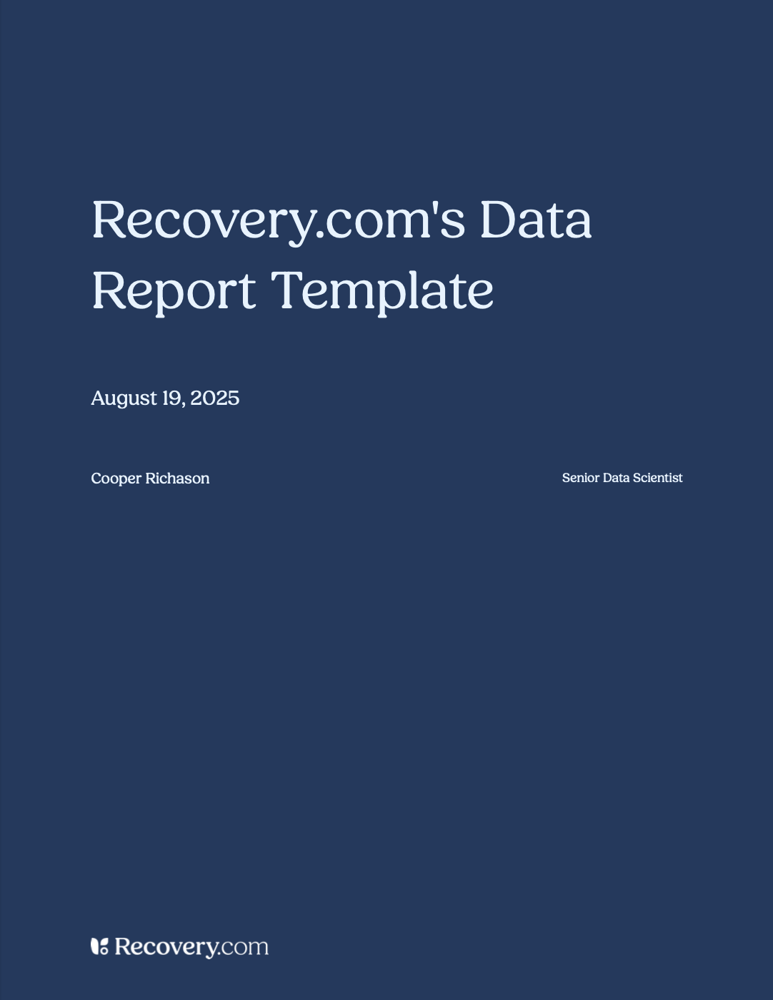

# Data-report Format

This template is designed to be a starting point to create data reports for Recovery.com.

## Installing
```bash
quarto use template Recovery-com-Data/data-report
```

This will install the format extension and create an example qmd file
that you can use as a starting place for your document.

## Example


